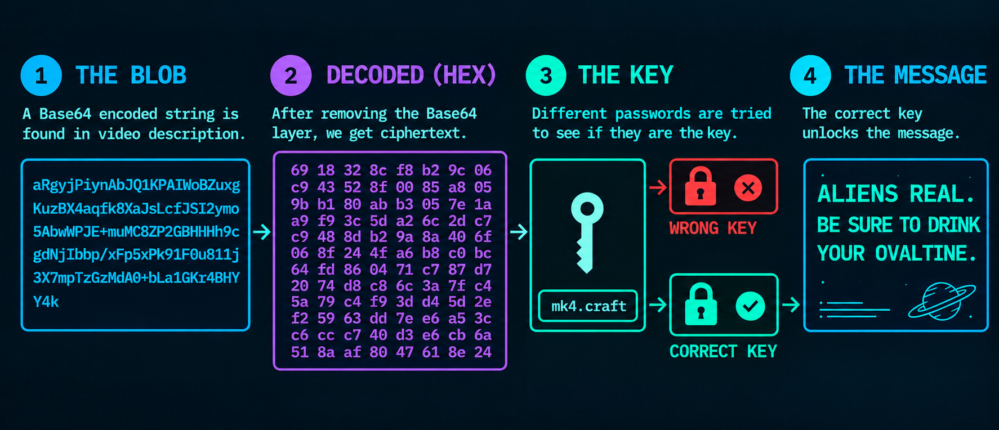
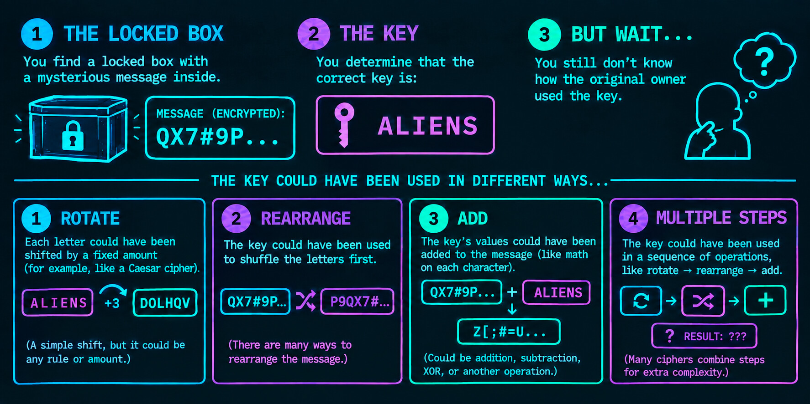
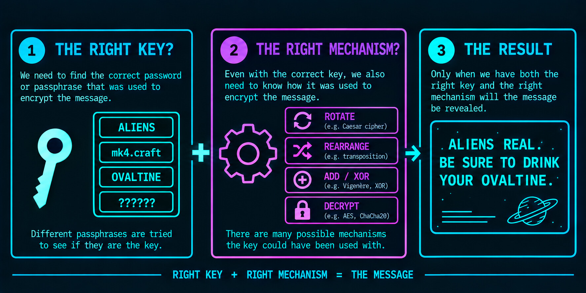
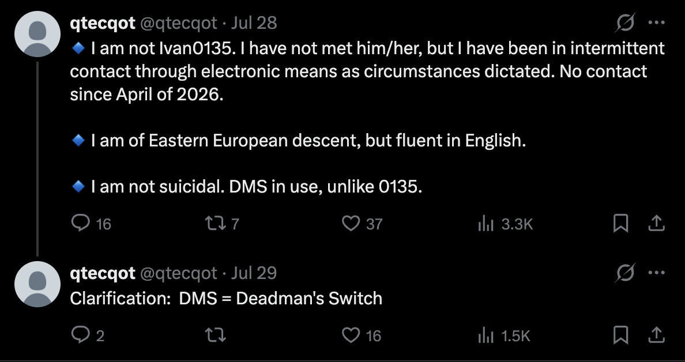

# @qtecqot - red pill cipher

In the description of ```@qtecqot```'s [video](https://www.youtube.com/watch?v=bg1BmaF6AJA) is the following mysterious text:

```
blue pill:
¯\_(ツ)_/¯

red pill:
aRgyjPiynAbJQ1KPAIWoBZuxgKuzBX4a
qfk8XaJsLcfJSI2ymo5AbwWPJE+muMC
8ZP2GBHHHh9cgdNjIbDp/xFp5xPk91F0
u8llj3X7mpTzGzMdA0+bLalGKr4BHYY4k
```

The **red pill** ```BLOB``` seems to be encrypted data.  In other words, *a secret code*.

## Cryptography 101
Cryptography is the science of keeping information secure. It works by scrambling a message into a secret code so that anyone who intercepts it only sees gibberish. To read the real message, the recipient must use a special **key** that acts like a password to unscramble it.  

Here is a simplified overview of how we could unlock the message:



### The Wrinkle

Unfortunately, finding the right key isn't enough. We also need to know how the key was used to lock the message:


So to unlock the message, we need both the **right key** and **right mechanism**.



## Cryptography 911

Since I'm not a cryptanalyst, five different AI engines were asked to do cryptanalysis of the ```BLOB```:
* Opus 5.0
* GPT-5.6 Luna
* Deepseek V4
* Gemini Pro
* Qwen-3.6

GPT-6 Astra (Medium) was then asked to: 
* Analyze the documents and try to disprove the theories presented.
* Do an independent cryptanalysis of the ```BLOB```.
* Compile all findings into a single comprehensive document.

### Key Findings

```
offset  hexadecimal bytes
00      69 18 32 8c f8 b2 9c 06 c9 43 52 8f 00 85 a8 05
10      9b b1 80 ab b3 05 7e 1a a9 f9 3c 5d a2 6c 2d c7
20      c9 48 8d b2 9a 8e 40 6f 05 8f 24 4f a6 b8 c0 bc
30      64 fd 86 04 71 c7 87 d7 20 74 d8 c8 6c 3a 7f c4
40      5a 79 c4 f9 3d d4 5d 2e f2 59 63 dd 7e e6 a5 3c
50      c6 cc c7 40 d3 e6 cb 6a 51 8a af 80 47 61 8e 24
```

The ```BLOB``` decodes cleanly to **96 bytes** of binary data. It does not immediately reveal readable text, another ordinary Base64 layer, or a recognizable file format.

1. **The bytes look random under the tests performed.** That is consistent with encryption, but it does not prove encryption. Hashes, signatures, and other binary data can look similar.

2. **The length does not identify AES or a particular encryption mode.** Although 96 is divisible by 16, several different encryption methods and data layouts fit that size.

3. **Common compression formats failed to decode.** This includes gzip, zlib, raw DEFLATE, bzip2, and standard LZMA/XZ containers. Data compressed before encryption remains possible.

4. **Simple transformations did not reveal readable text.** More than 74,000 defined transformation attempts were tested, including single-byte XOR, byte shifts, and bit rearrangements.

5. **There is one strong exclusion for repeating-key XOR:** a repeating key shorter than 95 bytes cannot turn the entire blob into ordinary ASCII text. This conclusion does not cover binary headers, compressed content, or other preprocessing.

**We cannot tell which algorithm was used**, whether the blob contains an IV/nonce or authentication tag, how a password might become a key, **or whether the content is an encrypted message at all**.

### Full Findings
The [comprehensive cryptanalysis](cryptanalysis/cryptanalysis.md) is available for review.


## Clues

### 1. The Matrix 
The **red pill** and **blue pill** are references to the film [The Matrix (1999)](https://www.imdb.com/title/tt0133093/). Here is the line from the movie where Morpheus mentions them:

> “That you are a slave, Neo. Like everyone else you were born into bondage, born into a prison that you cannot smell or taste or touch. A prison for your mind…. Unfortunately, no one can be told what the Matrix is. You have to see it for yourself. This is your last chance. After this there is no turning back. You take the **blue pill**, the story ends, you wake up in your bed and believe whatever you want to believe. You take the **red pill**, you stay in Wonderland, and I show you how deep the rabbit hole goes…”

### 2. YouTube Riddle

In the video comments, ```@marySol10039``` posted an early AI assisted analysis of the ```BLOB```:

> Current Analysis Status:
> * 96-Byte Structure: The Base64 string decodes to exactly 96 bytes. Because 96 is evenly divisible by 16, this is highly likely a standard block cipher (AES-128/256) or a cryptographic hash certificate.
> * Tested & Failed: Automated scripts (XOR & AES-CBC/ECB) using standard lore terms (qtecqot, ivan0135, SkinnyBob, Species 13), case numbers (24, 34, 38, 40), and timestamps produced no readable plaintext.
>
>Takeaway: The password is not a simple word directly pulled from the text description.
>
>-- TRIMMED --
>
>If you spot any hidden codes or anomalous frames in these tapes, please share them....
>
>Is someone capable doing it?

```@qtecqot``` responded with the following riddle, the ***only comment*** they've made on their channel:

>Stay the course. Your direction is true, but falling trees make no sound when they're alone. Better to watch the sun.

⚠️ As of 9/10/26, this comment thread has vanished from the video. View the [archived screenshot here](images/yt_clue.jpg).

## Concerns

### Dead Man's Switch

On July 28, `@qtecqot` mentioned on X that he has a dead man's switch mechanism.



> A **dead man's switch** is an automated security mechanism designed to publish or transmit pre-stored data if the user becomes incapacitated, detained, or passes away.  

If the ```BLOB``` has something to do with the dead man's switch, we're probably out of luck because the key would be very secure. Imagine ```aliens.crashed.N.1947-outside-Roswell,NM!```, which would be nearly impossible to guess or infer.

## Found Something?

[Tell us about it](https://www.reddit.com/r/qtecqot) on Reddit.